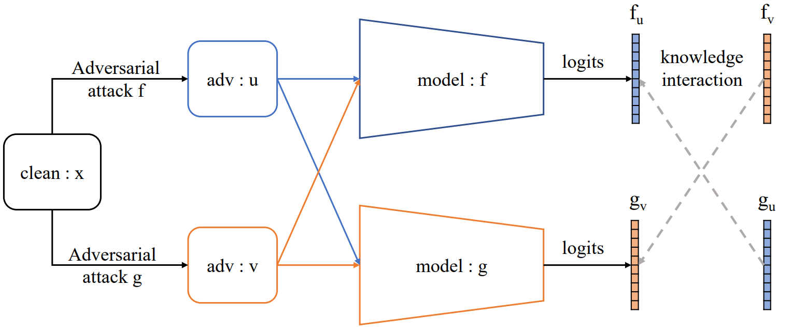
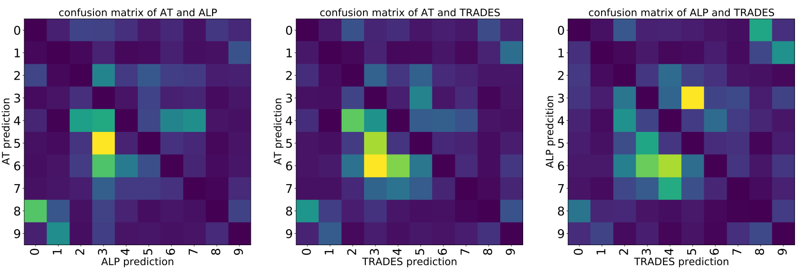
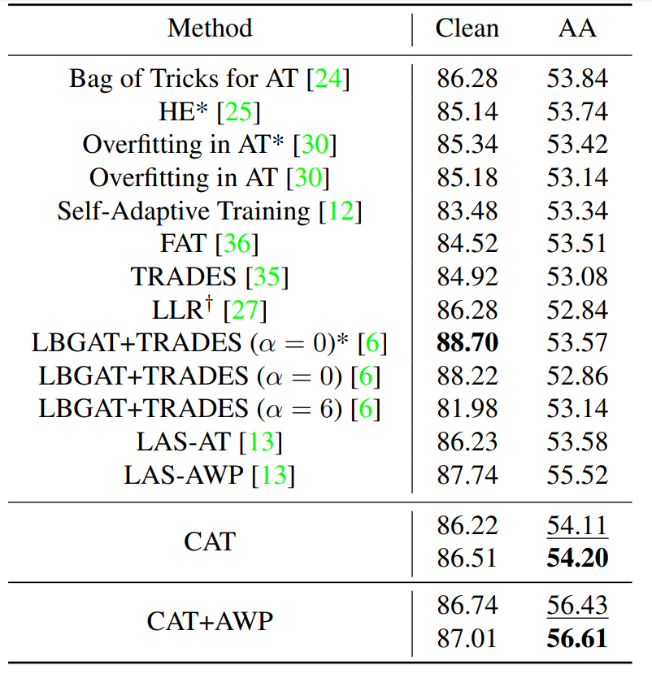

# CAT: Collaborative Adversarial Training

This is the official implementation of [Collaborative Adversarial Training](https://arxiv.org/abs/2303.14922).
<p align="center">
  
</p>


## News :tada:
- May 2023 - Release the code and models.
- March 2023 - Release the pre-print on [arXiv](https://arxiv.org/abs/2303.14922).


## Installation
This repo is built upon `python==3.8.5` and `pytorch==1.6.0`.

## What we found
Different knowledge is mastered by models trained by different methods.

<p align="center">
  
</p>


## Results
The comparison of CAT with SOTA. Please refer to our paper for more details.

<p align="center">
  
</p>


## License

This project is under the Apache 2.0 license as found in [LICENSE](LICENSE) file.

## Citing CAT

Please consider citing CAT and giving a star if CAT helps your research:
```
@article{liu2023cat,
  title={CAT: Collaborative Adversarial Training},
  author={Liu, Xingbin and Kuang, Huafeng and Lin, Xianming and Wu, Yongjian and Ji, Rongrong},
  journal={arXiv preprint arXiv:2303.14922},
  year={2023}
}
``` 